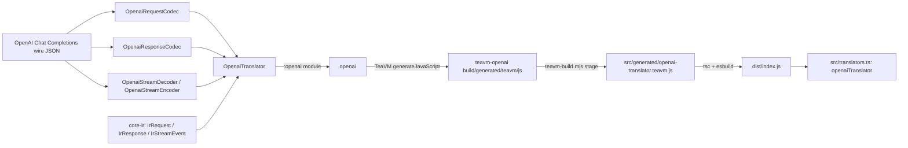

OpenAI Chat Completions vendor translator for the canonical IR (internal representation) used
across the intisy AI-tooling ecosystem. Java + TeaVM single-source, so the exact same request,
response, and streaming codecs compile to a JVM jar and to a JS module: any front-door or provider
that needs to speak OpenAI's wire format converts it to and from `core-ir`'s neutral IR through one
shared, tested implementation instead of a bespoke per-app reimplementation.

## Under-the-Hood Architecture



`OpenaiTranslator` implements `core-ir`'s `Translator` SPI: `decodeRequest`/`encodeRequest`,
`decodeResponse`/`encodeResponse`, and stateful `newStreamDecoder()`/`newStreamEncoder()` for true
streaming (no buffer-and-reconvert). The `:openai` module holds the codecs and is zero-dependency,
Java-8-clean; `:teavm-openai` is the TeaVM export surface over `:openai` and core-ir's `:ir`
module, transpiled to a single JS bundle. The TS surface (`openaiTranslator`) is a thin async
wrapper over that generated JS, so callers never touch the TeaVM handle directly.

## Structure

- `src/index.ts` - `loadOpenaiTranslator()`, a lazily-memoized dynamic import of the TeaVM ESM
  bundle, plus the public barrel re-exporting `translators.ts` and `core-ir`'s IR types.
- `src/translators.ts` - the public, typed TS API: `openaiTranslator`, with
  `decodeRequest`/`encodeRequest`/`decodeResponse`/`encodeResponse` (thin async wrappers over the
  TeaVM exports) and `decodeStream()`/`encodeStream()`, which return a real `TransformStream`
  driven chunk-by-chunk by the stateful Java handle.
- `src/driver.ts` - a small CLI driver (`node dist/driver.js <payload.json>`) that decodes a wire
  request to IR and re-encodes it, useful for manual smoke checks.
- `src/generated/openai-translator.teavm.d.ts` - hand-authored ambient types for the staged JS (the
  `.js` itself is gitignored build output).
- `src/__tests__/` - `smoke.test.ts` (toolchain round trip) and `translators.test.ts` (request,
  response, and streamed-response round trips through the `TransformStream` helpers).
- `openai/` - the OpenAI codecs (`OpenaiRequestCodec`, `OpenaiResponseCodec`,
  `OpenaiStreamDecoder`, `OpenaiStreamEncoder`, `OpenaiBlockCodec`, `OpenaiUsageCodec`,
  `OpenaiFinishReason`) plus `OpenaiTranslator`, the `Translator` implementation that ties them
  together. Depends on core-ir's `:ir` module for the IR types and the codec SPI.
- `teavm-openai/` - the TeaVM JS export surface (`OpenaiTranslatorJs`), transpiling `:openai`
  and `:ir` to `openai-translator.js`.
- `settings.gradle` / `build.gradle` / `gradlew*` - self-contained Gradle build
  (Java 8 for `:openai`, Java 17 override for `:teavm-openai`), declaring core-ir's `:ir`
  module as a github-gradle coordinate.

## Installation

TypeScript, as a published npm package:

```bash
npm install @intisy-ai/openai-translator
```

Java, as a `github-gradle` coordinate resolving this repo's released `:openai` jar:

```groovy
githubImplementation "intisy-ai:openai-translator:1.1.0:openai"
```

No checkout of this repo or of `core-ir` is needed, or wanted: a nested checkout is a third
resolver beside the package manifest and the build file, and it can disagree with both.

## Usage

```ts
import { openaiTranslator } from "openai-translator";

const ir = await openaiTranslator.decodeRequest(wireJson);
const backToWire = await openaiTranslator.encodeRequest(ir);

const response = await openaiTranslator.decodeResponse(responseWireJson);
const wireResponse = await openaiTranslator.encodeResponse(response);

const decodeStream = await openaiTranslator.decodeStream();
const irEvents = upstreamSseBody.pipeThrough(decodeStream); // ReadableStream<IrStreamEvent>

const encodeStream = await openaiTranslator.encodeStream();
const wireSse = irEventStream.pipeThrough(encodeStream); // ReadableStream<string>
```

`openaiTranslator` satisfies `core-ir`'s `VendorTranslator` interface, so any front-door that
already speaks that interface for another vendor can adopt OpenAI support by swapping in this
translator.

## Testing

Java: `cd java && ./gradlew test` (JUnit 5, `:openai` module: request, response, and streaming
round-trip tests against fixture payloads).

TS: `npm run build && npx vitest run` (`build` stages the TeaVM JS, `tsc`s, then bundles with
esbuild; `test` round-trips the translator from TS, including a full streamed response through the
`TransformStream` helpers). Both layers use the same round-trip fixture approach: a captured OpenAI
wire payload decoded to IR and re-encoded, asserting the result matches the original shape rather
than a byte-identical string.
